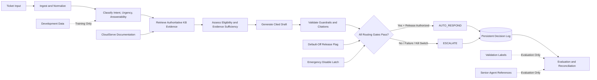

# CloudServe Architecture

This document is the single architecture reference for the implemented CloudServe release candidate.

It describes the executable system boundaries and validated behavior of the submitted implementation. It does not describe a proposed future platform.

---

## System Overview

